# OTWIN COMPONENTS

## Components map
 
One module per physical domain, and every component plays one of six roles. That is all a newcomer needs to place any component.
 
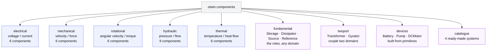
 
A capacitor, a mass, a water tank and a hot block of metal look like four different things. To the compiler 
they are the same thing: each one stores something and keeps count of how much is in it. That is its **role**. 
The domain (electrical, mechanical, hydraulic, thermal) only changes what the stored quantity is called and 
what units it carries.
 
The same goes for the rest. A resistor, a damper, an orifice and a wall losing heat are all "something that 
lets a flow through in proportion to a difference". A battery, a weight, a pump and a heater are all 
"something that pushes a quantity into the system". Ground, a fixed wall, the atmosphere and the ambient 
temperature are all "the zero we measure against".
 
So there are only six kinds of component. When you connect them, the compiler does not need to know 
any physics of your particular domain: it just needs to know which of the six roles each piece plays, 
and the rule for joining them is always the same (one shared quantity at every connection, the 
flows into it sum to zero). The names and units are a label for you; the role is what the machine works with.
 
## Roles 
 
Every port carries two variables: an **across** variable $e$ (voltage, velocity, 
angular velocity, pressure, temperature), measured as a difference between two points, 
and a **through** variable $f$ (current, force, torque, volume flow, heat flow), which passes 
through the element. In every domain but thermal their product is a power, $P = e\,f$.
 
A connection joins ports into a node. At a node the across variable is shared and the through variables sum to zero:
 
$$
e_1 = e_2 = \dots = e_n, \qquad \sum_{k=1}^{n} f_k = 0 .
$$
 
That single rule is Kirchhoff's laws, Newton's third law, mass conservation at a pipe junction and heat conservation at a wall.

Each **role** is one relation between $e$ and $f$ at the element's ports.
  
- **Across storage** (capacitor, mass, inertia, tank, thermal mass).
A state $x$ accumulates the through variable and the across variable is the gradient of the stored energy:
 
$$
\dot x = f, \qquad e = \frac{\partial H}{\partial x}, \qquad
\text{examples   } H = \frac{q^2}{2C}\; \frac{p^2}{2m}\; \frac{L^2}{2J}\; \frac{\rho g V^2}{2A}
$$
 
Because it sets $e$ from its own state, an across storage *pins* the node it sits on.
 
- **Through storage** (inductor, spring, torsion spring, fluid inertance).
The roles of $e$ and $f$ swap. The state accumulates the across variable and the through variable is the energy gradient $\dot x:

$$
\dot x = e, \qquad f = \frac{\partial H}{\partial x}, \qquad
\text{examples    } H = \frac{\phi^2}{2L}\; \frac{k\,q^2}{2}\; \frac{k_\theta\,\theta^2}{2}\; \frac{\Gamma^2}{2 L_h}
$$
 
- **Resistor** (resistor, damper, orifice, pipe, thermal resistance, convection). 
No state. A static law relates the two,
 
$$
f = \varphi(e), \qquad e\,\varphi(e) \ge 0 \;\; \forall e 
$$
 
linear in the common case, $f = e/R$, and nonlinear whenever you pass `law=` : $Q = \mathrm{sign}(\Delta p)\,c_d A\sqrt{2|\Delta p|/\rho}$ for an orifice, $F = c\,\Delta v\,|\Delta v|$ for quadratic drag. The sign condition says it can only absorb power. The compiler writes it in secant form $f = g(e)\,e$ with $g = \varphi(e)/e \ge 0$, and $g$ is what lands in the dissipation matrix $R$.
 
- **Source** (voltage, current, force, velocity, torque, speed, pressure, flow, heat, ambient).
No state, no law: it fixes one of the two variables regardless of the other,
 
$$
e = u(t) \quad \text{(across source)} \qquad\text{or}\qquad f = u(t) \quad \text{(through source)} .
$$
 
`None` makes $u$ an input of the compiled model; a number makes it a constant parameter. Either way its power $e\,f$ is what enters the energy balance.
 
- **Reference** (ground, fixed, housing, atmosphere). 
The datum for the across variable:
 
$$
e = 0 .
$$
 
- **Two-port** (transformer, gyrator).
Two branches, no state, no loss. The transformer scales, the gyrator crosses:
 
$$
\text{transformer: } e_2 = r\,e_1,\;\; f_1 = -r\,f_2 ; \qquad
\text{gyrator: } e_2 = r\,f_1,\;\; e_1 = -r\,f_2 ;
$$
 
both satisfy $e_1 f_1 + e_2 f_2 = 0$, so they move power between domains without creating or destroying any. That is why they land in the skew-symmetric $J$, never in $R$.
 
## Port-Hamiltonian Systems

Assembling these relations with the node rule is what the compiler does. The result is the port-Hamiltonian form:

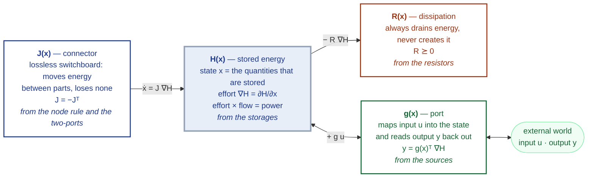
 
Read it left to right: the connector $J$ shuffles energy between the stores in $H$ without losing any; the resistors $R$ drain some of it; the ports $g$ let the outside world push energy in ($u$) and read the matching quantity back ($y$). Adding the three arrows into $H$ gives the equation:
 
 
$$
\dot x = \big(J(x) - R(x)\big)\,\nabla H(x) + G(x)\,u, \qquad
y = G(x)^{\top}\nabla H(x) + D(x)\,u ,
$$
 
and every role contributes to exactly one place in it:
 
| From | Into | What it is |
|---|---|---|
| storages (across and through) | $x$, $H(x)$ | the state vector stacks their states; $H$ is the sum of their energies |
| the node rule joining storages, and the two-ports | $J(x) = -J(x)^{\top}$ | how energy moves between storages without loss; a mass linked to a spring, a capacitor to an inductor, an electric machine coupling current to torque |
| resistors | $R(x) \succeq 0$ | where energy leaves; the secant $g(e)$ of every law |
| sources | $G(x)$, $D(x)$ | which storage each input pushes on, and which output it feeds directly |
| reference | nothing | it only fixes which node is $e = 0$ |
 
Because $J$ is skew-symmetric and $R$ is positive semidefinite by construction, the energy balance
 
$$
\frac{dH}{dt} = P_{\text{ports}} - P_{\text{lost}}
$$
 
The power through the ports is the product of what goes in and what comes out:
 
$$
P_{\text{ports}} = y^{\top} u
$$
 
The power lost in the resistors is never negative, because $R$ is positive semidefinite:
 
$$
P_{\text{lost}} = \nabla H^{\top} R \nabla H \ge 0
$$
 
Combining the three together:
 
$$
\frac{dH}{dt} \le y^{\top} u
$$
 
The stored energy can never grow faster than what the sources supply. The connector $J$ does not appear in the balance at all: being skew-symmetric, $\nabla H^{\top} J \nabla H = 0$, it moves energy around but neither adds nor removes any. This holds for any system built from the six roles, and it is a property of the model, not of the solver.

| Role | What it contributes | Components in Otwin |
|---|---|---|
| **Across storage** | one state; its across variable pins the node | `Capacitor`, `Mass`, `Inertia`, `Tank`, `ThermalMass` |
| **Through storage** | one state; its through variable is `dH/dx` | `Inductor`, `Spring`, `TorsionSpring`, `FluidInertance` |
| **Resistor** | an algebraic law `through = law(across)`, linear or nonlinear | `Resistor`, `Damper`, `RotationalDamper`, `Orifice`, `Pipe`, `ThermalResistance`, `Convection` |
| **Source** | `None` makes it an input, a value a constant parameter | `VoltageSource`, `CurrentSource`, `ForceSource`, `VelocitySource`, `TorqueSource`, `SpeedSource`, `PressureSource`, `FlowSource`, `HeatSource`, `Ambient` |
| **Reference** | across = 0 | `Ground`, `Fixed`, `Housing`, `Atmosphere` |
| **Two-port** | lossless coupling of two domains; lands in `J`, never in `R` | `Transformer`, `Gyrator` |
 
Two-port elements are `p`,`n` in the electrical domain and `a`,`b` elsewhere. One-port storages and sources are 
`flange` (mechanical), `shaft` (rotational), `port` (hydraulic, thermal). The initial state is set with the quantity 
you would measure: `voltage=`, `velocity=`, `speed=`, `level=`, `temperature=`, `extension=`, `twist=`, `current=`, `flow=`.
 
## Components by domain
 
Each colour identifies a role. Dark blue is the **across storage**, light blue the **through storage**, orange is the **resistor**, 
dark green is the **across source**, light green is the **through source**, grey is the **reference**, purple is the **two-port**, and
magenta is the **composite**.
 
### Electrical
 
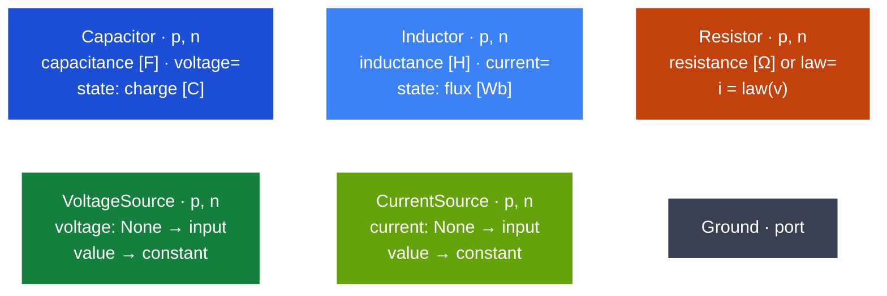
 
### Mechanical
 
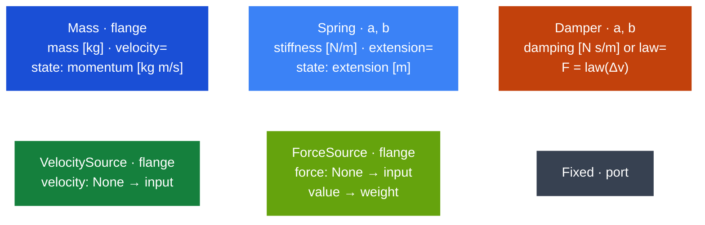
 
### Rotational
 
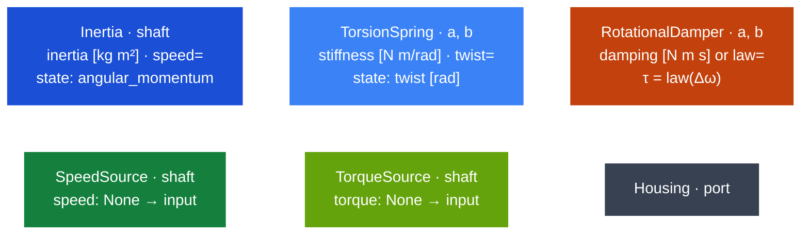
 
### Hydraulic
 
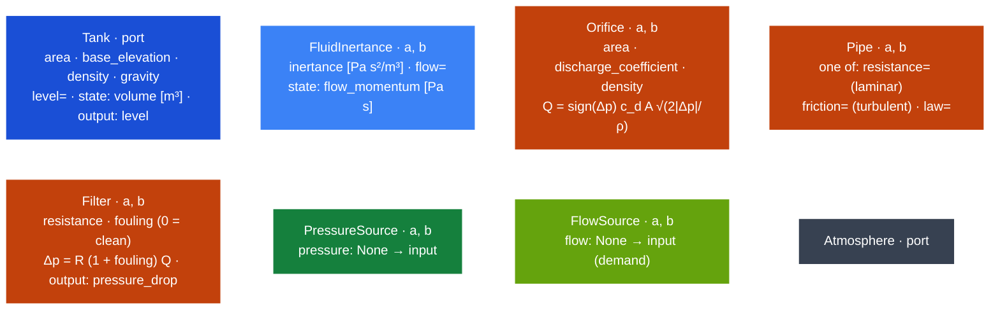
 
### Thermal
 
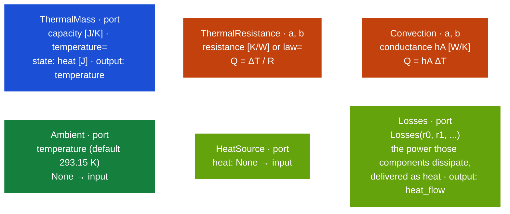
 
Temperature × heat flow is not a power, so a thermal model compiles as `pseudo-port-hamiltonian`: the heat balance is exact, the energy audit is a stability statement.
 
### Two-ports: coupling two domains
 
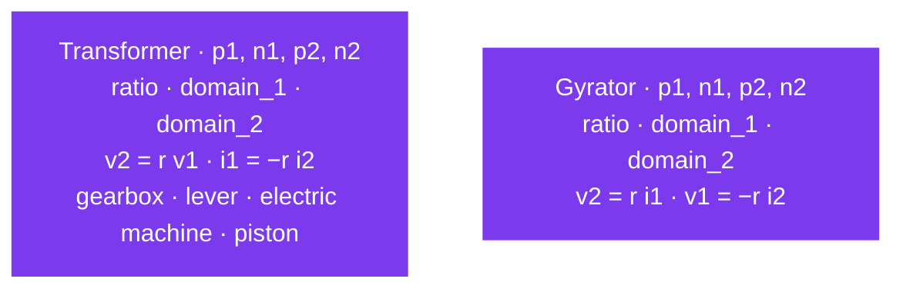
 
Both conserve power exactly, so the compiler puts them into `J`, never into `R`.
 
### Composites: devices built from primitives
 
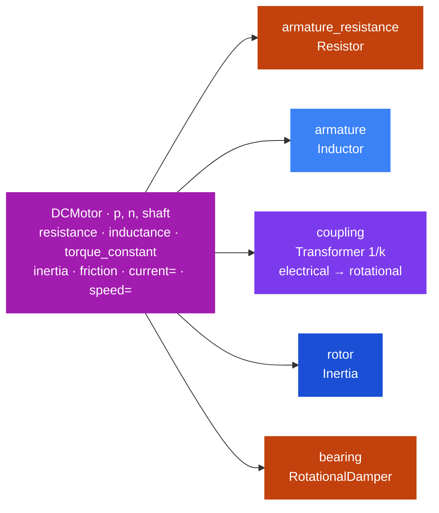

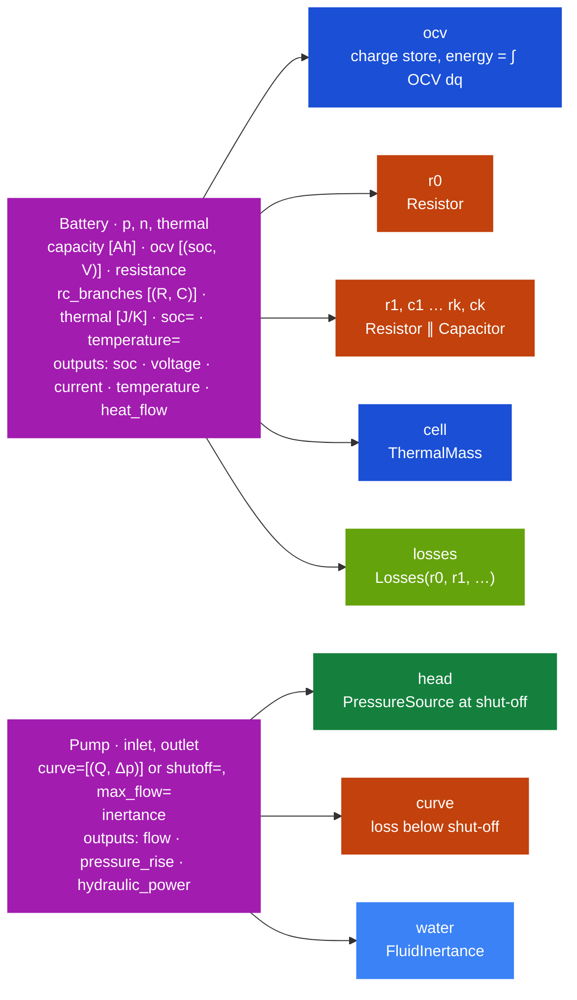
 
The compiler flattens a composite before anything else and names the parts `motor.armature`, `bat.ocv`, `pump.water`, so their currents, speeds, flows and powers are ordinary outputs. `Battery` and `Pump` are described in [the devices guide](docs/modeling/devices.md).
 
### Catalogue of ready-made systems included in Otwin
 
| Function | Built from | States |
|---|---|---|
| `mass_spring_damper(m, k, c, position, velocity)` | `Mass` + `Spring` + `Damper` + `Fixed` | `spring.extension`, `mass.momentum` |
| `water_tank(A, a, g, c_d, rho, level)` | `Tank` + `Orifice` + `FlowSource` inlet + `Atmosphere` | `tank.volume` |
| `dc_motor(L, inertia, Re, b, K)` | `VoltageSource` supply + `DCMotor` + `Ground` + `Housing` | `motor.armature.flux`, `motor.rotor.angular_momentum` |
| `pumped_hydro(A_u, A_l, z_u, R_penstock, ...)` | two `Tank` + `Pipe` + `FlowSource` pump + `Atmosphere` | `upper.volume`, `lower.volume` |
 
Each returns a `System` whose state order matches the hand-written 0.4 model of the same name, so the two can be compared number for number.
 
## `base.py`

This is the file that says what a component *is*. Everything else in `otwin.components` is built from the pieces defined here. Think of a 
component as a small box with a few plugs on it. The  **component** declares **ports** and **parameters** and returns **branches**. Otwin compiler reads only the **branches**.
`Fixed`, `Housing` and `Atmosphere` are `Ground` under a domain-appropriate name. `Composite` holds parts and 
the links between them; the compiler flattens it first and names the parts `<device>.<part>`.

| Component | Port | Parameters | Branch | Composite | Ground |
|---|---|---|---|---|---|
|The box itself. When you write your own, you declare the ports, declare the parameters, and return the branches. That is all. The compiler  never runs any other method of your component; it only reads the branches.| A plug. It is where you connect the component to others. A resistor has two (`p` and `n`), a mass has one (`flange`), a tank has one (`port`). Two ports joined together share the same voltage, velocity, pressure or temperature; that is the only thing a connection means.| A number written on the box: resistance, stiffness, capacity. It has a value and a unit, and it stays symbolic through compilation, so you can change it later or let an estimator fit it.| The physics inside the box, written as one relation between two ports: "this is a storage", "this is a resistor with this law", "this is a source", "this is one side of a transformer". There are four kinds (`StorageBranch`, `ResistorBranch`, `SourceBranch`, `TwoPortBranch`), one per role.| A box made of other boxes. `DCMotor` is one: inside it there is a resistor, an inductor, a transformer, an inertia and a damper, already wired. Before compiling, the compiler opens the composite, takes the parts out and renames them `motor.armature`, `motor.rotor`, `motor.bearing`. From then on they are ordinary components and their currents, speeds and powers are ordinary outputs.| The zero point: the port against which everything else is measured. `Fixed` (mechanical), `Housing` (rotational) and `Atmosphere` (hydraulic) are the same class under the name an engineer in that field would use. Connect to it anything that is nailed down.|

 
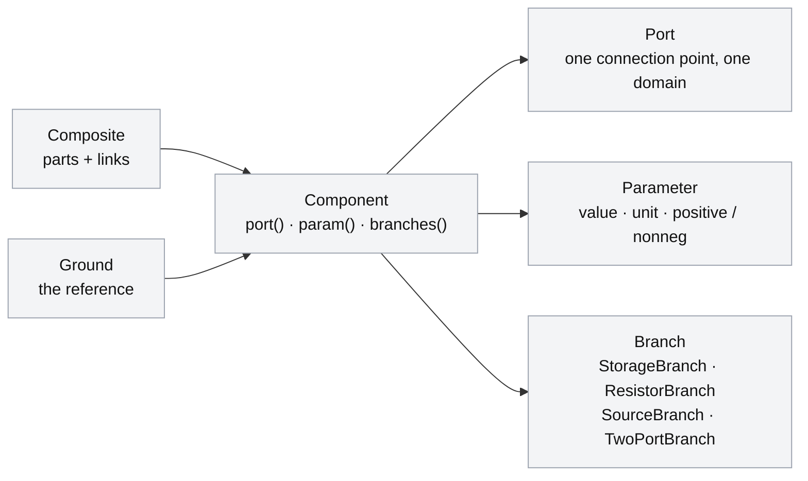
