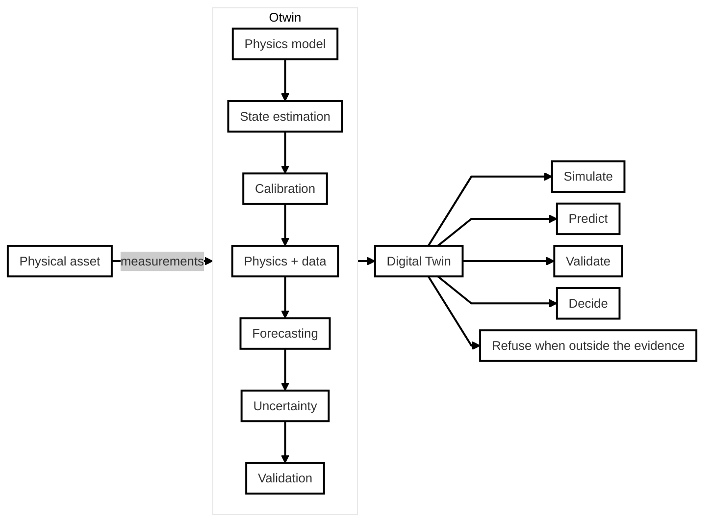
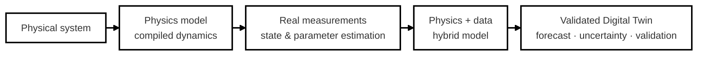
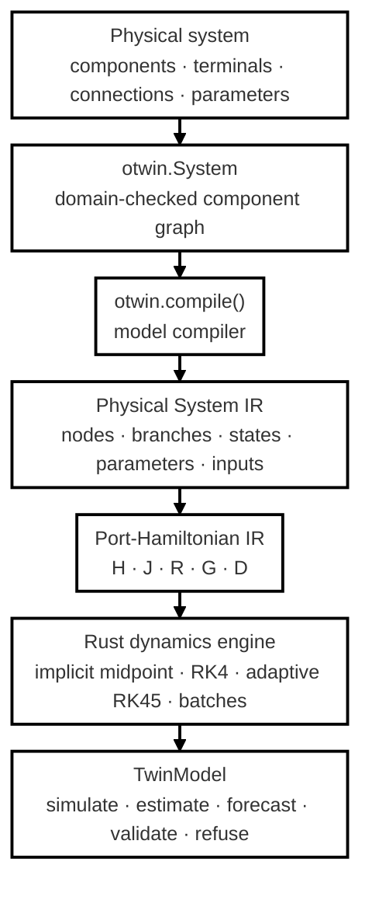
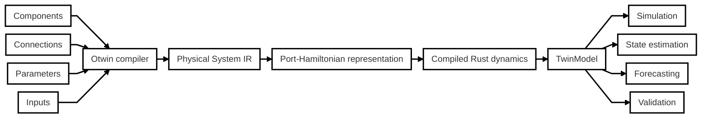
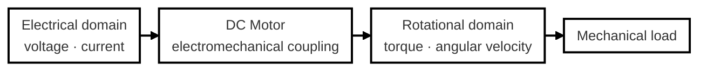
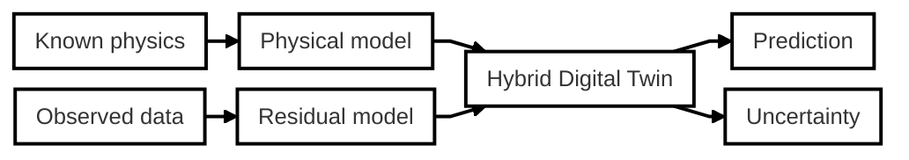
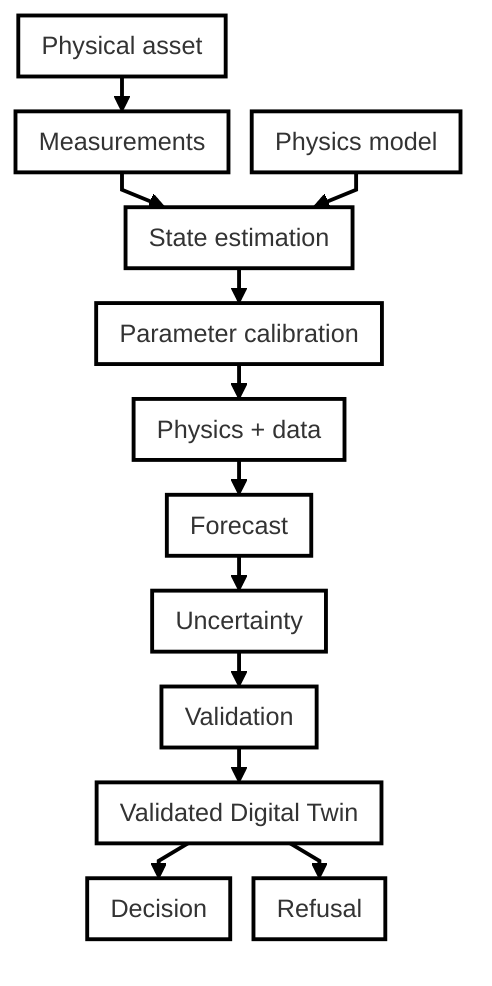
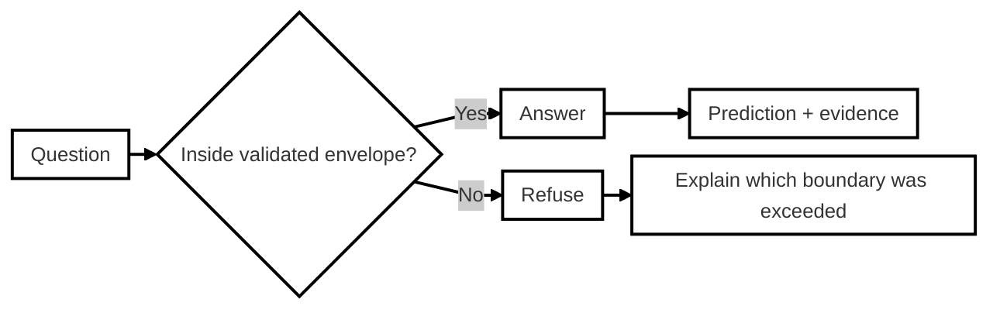
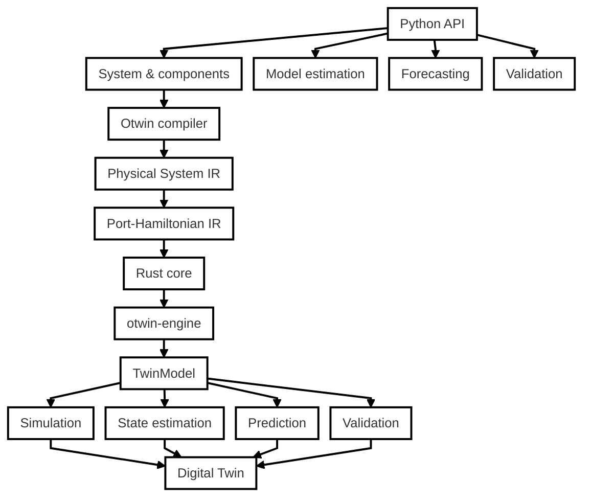

<div align="center">


# The open-source physics engine for engineering Digital Twins

Build physically consistent models from components and connections, compile them into a fast dynamics engine, connect them to real measurements, and turn them into Digital Twins that can simulate, estimate, forecast, validate — and know when not to answer.

</div>

<br>

<div align="center">

[](https://github.com/otwin-core/otwin/blob/main/LICENSE)

[](https://pypi.org/project/otwin/)
[](https://github.com/otwin-core/otwin/actions/workflows/rust.yml)
[](https://github.com/otwin-core/otwin/actions/workflows/ci.yml)
[](https://www.bestpractices.dev/projects/14061)
[](https://scorecard.dev/viewer/?uri=github.com/otwin-core/otwin)
[](https://api.reuse.software/info/github.com/otwin-core/otwin)
[](https://github.com/otwin-core/otwin/attestations)

</div>

<br>

<div align="center">

[What is Otwin?](#what-is-otwin) ·
[Why Otwin?](#why-otwin) ·
[Install](#install) ·
[Quick start](#quick-start) ·
[How it works](#how-it-works)

[Physics engine](#the-physics-engine) ·
[Components](#components) ·
[Multi-domain physics](#multi-domain-physics) ·
[Physics + data](#physics--data)

[State estimation](#state-estimation) ·
[Uncertainty](#uncertainty) ·
[Validation](#validation) ·
[Examples](#examples) ·
[Project](#the-otwin-project)

</div>

<br>

## What is Otwin?

**Otwin is an open-source physics engine and Digital Twin framework for real engineering systems.** You describe a physical system as components and connections — the same way you would draw the system. Otwin compiles that description into a physically consistent dynamical model, runs it in a high-performance Rust engine, and provides the tools needed to keep that model synchronized with a real asset.



A Digital Twin is a model of **one particular physical asset** — a machine, pump, battery bank, heat exchanger, or complete process — kept up to date from that asset's own measurements and run forward to support decisions about it.

These are some of the engineering questions we want to answer:

|Electrical grid|Renewable generation and storage|Water treatment|
|---|---|---|
| This distribution transformer keeps running above nameplate on hot afternoons. How much longer can it do that before the winding reaches its thermal limit?| This battery bank is three years into its life. How much can I commit to the market next week and still be certain of delivering it? |The transfer pumps need more power every month for the same flow. How many weeks of margin are left before the duty pump can no longer hold its setpoint?|

To answer these you need a model of the asset that is:

- right by construction where the physics is known;
- able to represent what the physics does not know;
- fast enough to run repeatedly against real data;
- calibrated and validated against observations;
- explicit about the limits of what it has actually demonstrated.

<br>

## Why Otwin?

Engineering systems are neither purely physical nor purely data-driven. You usually know some equations like conservation laws, energy storage, fluid behaviour, thermal behaviour, or component relationships. There are alos mechanism that we don't know exactly the necessary equations like friction, losses, unknown loads, unmodelled phenomena, or sensor noise.

**Physical models provides the structure. Data identifies what you do not know. The Digital Twin keeps the model synchronized with the asset. Validation tells you whether the model has earned the right to answer.**

Otwin connects:




## Install

```bash
pip install "otwin[engine]"
```

`otwin` is the Python framework. `otwin[engine]` adds the compiled Rust runtime, with binary wheels for Linux, macOS and Windows. Without it, every model still runs on the NumPy reference backend, about a hundred times more slowly.

<br>

## Quick start

A mass hanging from a spring with a damper, under gravity. Otwin writes the equations.

<div align="center">


</div>

```python
import otwin
from otwin.components.mechanical import Mass, Spring, Damper, ForceSource, Fixed

k, m, c, g0 = 20.0, 1.0, 0.3, 9.81

mass = Mass(m, name="mass")
spring = Spring(k, name="spring")
damper = Damper(c, name="damper")

weight = ForceSource(m * g0, name="weight")
ceiling = Fixed(name="ceiling")

system = otwin.System(
    mass,
    spring,
    damper,
    weight,
    ceiling,
)

system.connect(
    mass.flange,
    spring.a,
    damper.a,
    weight.flange,
)

system.connect(
    spring.b,
    damper.b,
    ceiling.terminal,
)

model = otwin.compile(system)

run = model.simulate(
    t_span=(0, 20),
    dt=0.05,
)

q = run["spring.extension"]

print(f"Static equilibrium q* = m g / k = {m*g0/k:.3f} m")
print(f"Lowest point reached: q = {q.max():.3f} m")
print(f"Final position: q = {q[-1]:.3f} m")

print(
    f"Largest energy violation: "
    f"{run.energy_balance()['max_violation']:.1e} J"
)
```

Output:

```text
Static equilibrium q* = m g / k = 0.491 m
Lowest point reached: q = 0.932 m
Final position: q = 0.477 m
Largest energy violation: 0.0e+00 J
```

- The mass settles at $q^* = mg/k$, below the natural length. Nobody wrote Newton's law; the compiler derived it from the components and connections.

- The compiled model is an energy-based system: stored energy can change only by what the ports supply and what the dampers remove. The energy balance is therefore part of the physical model.

- `model.summary()` tells you what the compiler built: states with their units, parameters, constant sources and representation. `model.structure()` gives the matrices. `model.ir()` exposes the internal representation.

<br>

## How it works
Otwin compiles the physical graph into executable differential equations. Every connection is a node where the across variable is shared (voltage, velocity, pressure, temperature). The through variables balance at the node (current, force, flow, heat flow).
Storage elements define how energy is stored, dissipative elements define losses, sources provide inputs, and two-ports couple different physical domains.



The resulting dynamics are expressed in port-Hamiltonian form:

$$ \dot{x} = \big(J(x)-R(x)\big)\nabla H(x) + G(x)u $$

where $H(x)$ is the stored energy, $J(x)$ describes energy exchange between components, $R(x)$ represents dissipation, and $u$ represents external inputs The port output is:

$$ y = G(x)^\top\nabla H(x) + D(x)u $$

Otwin builds $J$ as skew-symmetric, so it represents energy exchange rather than energy creation or destruction. Dissipative effects are represented explicitly through $R$. This makes the energy structure a property of the model itself, rather than something the numerical solver has to preserve by chance.

The port-Hamiltonian representation is an internal representation of the compiled model. You can inspect it with `model.ir()`, but you don't have to write it yourself.

### Errors are expressed in the language of components

Errors come out before the simulaion:

```text
CompileError: dependent storages or sources: load, motor.rotor form a loop that fixes the
same potential twice. Two capacitors in parallel, two inertias on one shaft, two masses
rigidly joined, a voltage source across a capacitor or a tank connected straight to a
pressure source all do this. Merge the two stores into one, or put a resistor, pipe,
damper or a stiff spring between them.
```

#### The compiler detects physically invalid topologies before the numerical solver ever sees them.
<br>

## The physics engine

Otwin is built around a **model compiler and dynamics engine**. The core workflow is:



#### Compiled dynamics run in the Rust layer, and the Python layer is where you describe and operate the model.

<br>

## Components

Otwin provides physical component primitives across diverse domains (see [COMPONENTS.md](https://github.com/otwin-core/otwin/blob/7f66a244b07547adb9cfca68b26241acc1989692/COMPONENTS.md)))

| Domain | Across | Through | Components |
|---|---|---|---|
| Electrical | voltage | current | `Resistor`, `Capacitor`, `Inductor`, `VoltageSource`, `CurrentSource`, `Ground` |
| Mechanical | velocity | force | `Mass`, `Spring`, `Damper`, `ForceSource`, `VelocitySource`, `Fixed` |
| Rotational | angular velocity | torque | `Inertia`, `TorsionSpring`, `RotationalDamper`, `TorqueSource`, `SpeedSource`, `Housing` |
| Hydraulic | pressure | flow | `Tank`, `Orifice`, `Pipe`, `FluidInertance`, `FlowSource`, `PressureSource`, `Atmosphere` |
| Thermal | temperature | heat flow | `ThermalMass`, `ThermalResistance`, `Convection`, `HeatSource`, `Ambient` |
| Two-ports | | | `Transformer`, `Gyrator` |
| Composites | | | `DCMotor`, and the `catalogue` of reference systems |

Every dissipative element takes a nonlinear `law=`.

For example:

```python
RotationalDamper(
    law=lambda w: (c1 + c2*w**2) * w
)
```
Sources with `None` become inputs of the model. Sources with a value become constant parameters. Every parameter stays symbolic through compilation, so:

```python
model.set_parameters(...)
```

changes it without recompiling and allows estimators to fit it. Adding a component means defining **terminals**, **parameters** and a **constitutive law**.

<br>

## Multi-domain physics

Real engineering systems rarely belong to one physical domain. A DC motor, for example, is an electrical circuit coupled to a rotating mechanical shaft.



`DCMotor` is itself a composite of primitives (`Resistor`, `Inductor`, `Transformer`, `Inertia`, `RotationalDamper`). The compiler sees the physical components and their connections, not a special-case motor equation.

```python
import otwin
from otwin.components.electrical import VoltageSource, Ground
from otwin.components.composite import DCMotor
from otwin.components.rotational import RotationalDamper, Housing

supply = VoltageSource(None, name="supply")

motor = DCMotor(
    resistance=1.0,
    inductance=0.5,
    torque_constant=0.5,
    inertia=0.01,
    friction=0.1,
    name="motor",
)

fan = RotationalDamper(
    law=lambda w: 0.002 * w * abs(w),
    name="fan",
)

gnd = Ground()
housing = Housing()

drive = otwin.System(
    supply,
    motor,
    fan,
    gnd,
    housing,
)

drive.connect(supply.p, motor.p)
drive.connect(supply.n, motor.n, gnd.terminal)

drive.connect(motor.shaft, fan.a)
drive.connect(fan.b, housing.terminal)

model = otwin.compile(drive)

run = model.simulate(
    t_span=(0, 3),
    dt=0.001,
    inputs={"supply": 24.0},
)

print(
    f"speed after 3 s: "
    f"{run['motor.rotor.angular_velocity'][-1]:.2f} rad/s"
)

print(
    f"current: "
    f"{run['motor.armature.current'][-1]:.3f} A"
)

p_in = -run["supply.power"][-1]

p_out = (
    run["motor.armature_resistance.power"]
    + run["motor.bearing.power"]
    + run["fan.power"]
)[-1]

print(
    f"electrical power in {p_in:.2f} W = "
    f"copper + bearing + fan {p_out:.2f} W at steady state"
)
```

Output:

```text
speed after 3 s: 29.36 rad/s   current: 9.320 A
electrical power in 223.68 W = copper + bearing + fan 223.68 W at steady state
```

The power accounting is exact because quantities are outputs derived by the compiler alongside the states.

```python
motor.bearing.power
supply.power
fan.torque
```
<br>

## Control laws

A converter holding constant power, a level valve, a thermostat: sometimes an input depends on the state.

Write the law as an expression over the model's own quantities and the compiler folds it into the model.

```python
import otwin
from otwin.expr import maximum
from otwin.components.catalogue import water_tank

tank = otwin.compile(
    water_tank(level=2.0)
)

level = tank.symbol("tank.level")

run = tank.simulate(
    t=range(0, 601),
    inputs={
        "inlet": maximum(
            0.0,
            5.0 * (1.5 - level),
        )
    },
)

print(
    f"level {run['tank.level'][0]:.3f} m "
    f"-> {run['tank.level'][-1]:.3f} m"
)

print(
    f"inflow {run['inlet'][0]:.3f} "
    f"-> {run['inlet'][-1]:.3f} m3/s"
)
```

Output:

```text
level 2.000 m -> 1.436 m
inflow 0.000 -> 0.319 m3/s
```

The tank settles below its 1.5 m setpoint because proportional-only control leaves an offset.

A Python function `f(t, x)` is accepted too. It runs sample-and-hold at the grid rate, which is the right model of a digital controller and the wrong one of a continuous valve.

<br>

## Physics + data

It's very common that equations that model an asset are not known. That does not mean the entire model has to become a black box. Otwin supports three modelling approaches:

<div align="center">

| | | |
|---|---|---|
|  | **White box** | Every equation and parameter comes from first principles. |
|  | **Grey box** | Physics fixes the structure; data estimates the unknown parts. |
|  | **Black box** | The data determines the model without an explicit physical structure. |

</div>

The compiled model is the white box.

Otwin gives you ways to add what it leaves out without rewriting the physics.


<br>

## Estimate the missing physics

Suppose the oscillator has quadratic drag that the original model does not know about. We can add one symbolic term with a new parameter and fit it from measurements.

```python
import numpy as np
import otwin
from otwin.components.catalogue import mass_spring_damper

physics = otwin.compile(
    mass_spring_damper(
        m=1.0,
        k=2.0,
        c=0.3,
        position=1.0,
    )
)

v = physics.symbol("mass.velocity")

plant = physics.with_residual(
    {
        "mass.momentum": -0.9 * v * abs(v)
    }
)

t = np.linspace(0, 8, 161)

measured = (
    plant.simulate(t=t)["spring.extension"]
    + np.random.default_rng(0).normal(
        0,
        1e-3,
        t.size,
    )
)

grey = physics.with_residual(
    {
        "mass.momentum":
            -physics.parameter("drag") * v * abs(v)
    },
    parameters={
        "drag": 0.1
    },
)

fit = otwin.fit_parameters(
    grey,
    t,
    {"spring.extension": measured},
    ["drag", "spring.stiffness"],
)

print(fit)
```

Output:

```text
FitResult(
    drag=0.900957,
    spring.stiffness=2.00025;
    cost=7.374e-05,
    evaluations=21,
    identified={
        'drag': True,
        'spring.stiffness': True
    }
)
```

`fit.identifiability` reports why you may believe the fitted values:

- no problematic collinearity;
- sufficient span of the data;
- stable values under bootstrap resampling.

---

## Hybrid models

When you cannot say what the physics leaves out, do not throw the physics away. Fit a model to the gap between physics and measurements, the residual, and add it on top.

```python
otwin.HybridModel(
    physics,
    residual,
)
```

The residual can be learnt with a Gaussian process (GP), a neural network (NN) or  another callable model. The physical model remains the prior structure. The learned model represents what the physics leaves unexplained. This creates a practical path from physics to data:



`otwin.hybrid.residual_data` gives you the training target: what the physics leaves unexplained.

<br>

## Custom dynamics

When a system is outside the component library, you can still use the rest of the Otwin stack.

```python
otwin.CustomDynamics(
    f,
    n_states,
    n_inputs,
)
```

The resulting model has the same core interface so it can be used with the estimation and forecasting tools.

```text
simulate()
step()
rhs()
observe()
```
<br>

## From model to Digital Twin

A simulation model becomes a Digital Twin when it is connected to a **specific physical asset**. The lifecycle is:



#### This is the difference between running a simulation and operating a Digital Twin. A simulation tells you what the model does. A Digital Twin tells you what the asset is doing — and what the model has earned the right to predict.

<br>

## State estimation

A compiled model is a `TwinModel`: it has `rhs` and `observe`, and measurements can be mapped directly onto model quantities. The estimators take it as it is.

| Estimator | Use it when |
|---|---|
| `ExtendedKalmanFilter` | Nonlinear model with approximately Gaussian measurement noise |
| `MovingHorizonEstimator` | The state has physical bounds |
| `EnergyConsistentObserver` | The correction itself must respect the energy balance |

The moving-horizon estimator accepts **box constraints on the state**. For example, a state of charge is not allowed to become `1.05` simply because a noisy sensor suggested it. The energy-consistent observer limits corrections so they cannot increase stored energy beyond what the ports supplied.

<br>

## Uncertainty

An interval has meaning if its **coverage has been measured**. A stated 90% interval should contain the truth about 90% of the time. Otwin calibrates uncertainty using real out-of-sample forecast errors.

```python
import numpy as np

from otwin.forecast import (
    rolling_origin_residuals,
    horizon_conformal,
)

rng = np.random.default_rng(0)

cycles = np.arange(300)

capacity = (
    1.0
    - 2.6e-4 * cycles
    - 4.0e-3 * np.sqrt(cycles)
    + rng.normal(0, 1.5e-3, 300)
)


class FadeLaw:
    """Fits C = C0 - a*n - b*sqrt(n) to history."""

    def forecast(self, history, horizon):
        h = np.asarray(history, float).ravel()
        n = np.arange(len(h))

        coef, *_ = np.linalg.lstsq(
            np.column_stack([
                np.ones_like(n),
                n,
                np.sqrt(n),
            ]),
            h,
            rcond=None,
        )

        f = np.arange(
            len(h),
            len(h) + horizon,
        )

        return (
            np.column_stack([
                np.ones_like(f),
                f,
                np.sqrt(f),
            ])
            @ coef
        ).reshape(-1, 1)


train = capacity[:240]


def refit_forecast(history, horizon):
    return FadeLaw().forecast(
        history,
        horizon,
    ).ravel()


residuals, horizons = rolling_origin_residuals(
    refit_forecast,
    train,
    step=5,
    max_horizon=60,
)

band = horizon_conformal(
    residuals,
    horizons,
    level=0.90,
    max_horizon=60,
)

lower, upper = band.apply(
    refit_forecast(train, 60)
)

truth = capacity[240:300]

print(
    f"{residuals.size} residuals "
    f"over horizons 1..{horizons.max()}"
)

print(
    f"half-width "
    f"{(upper[0]-lower[0])/2:.4f} at h=1, "
    f"{(upper[-1]-lower[-1])/2:.4f} at h=60"
)

print(
    f"measured coverage: "
    f"{np.mean((truth >= lower) & (truth <= upper)):.0%} "
    f"(target 90%)"
)
```

Output:

```text
1590 residuals over horizons 1..60
half-width 0.0023 at h=1, 0.0030 at h=60
measured coverage: 90% (target 90%)
```

The calibration uses rolling-origin errors rather than in-sample residuals. When the calibration set is too small to support the requested confidence level, the library returns an infinite half-width rather than a comfortable-looking interval that has not earned its confidence.

<br>

## Validation

A model is not validated because it fits historical data. Its forecasts need to be evaluated out of sample against meaningful reference forecasts.

```python
from otwin.forecast import evaluate

print(
    evaluate(
        FadeLaw(),
        capacity.reshape(-1, 1),
        protocol="rolling_origin",
        n_folds=5,
        horizon=30,
    )
)
```

Output:

```text
EvalReport (rolling_origin, 5 folds)
──────────────────────────────────────────────────────────────
Skill Score (vs best baseline): 0.77 (77% better)
Baseline: persistence

Point Metrics:
  RMSE      0.0017 (baseline: 0.0074)
  MAE       0.0014 (baseline: 0.0064)
  NRMSE     0.1141
  MASE      0.8292
  THEIL_U   0.2395
──────────────────────────────────────────────────────────────
```

The evaluation protocol is designed to avoid common mistakes:

- in-sample residuals being treated as forecast errors;
- information leakage between train and test;
- evaluating without a reference forecast;
- giving the model access to future test observations.

The evaluation leads with the skill score against the hardest of persistence, drift, mean, and seasonal naive.

<br>

## Identifiability

A fitted coefficient is not necessarily a determined coefficient. `otwin.estimate.identifiability` tests each coefficient for:

- **collinearity** — can its sensitivity be reproduced by the others?
- **span** — is the record long enough relative to the fitted time constant?
- **stability** — does bootstrap resampling produce the same value?

`fit_parameters` runs this analysis on sensitivities at the optimum. The resulting manifest records the verdicts, and the validation envelope can refuse a prediction when an important parameter is not identifiable.

<br>

## Validity envelopes

A Digital Twin should know the boundary of its evidence.

`model.manifest()` starts a `TwinManifest` for a compiled model:

```python
model.manifest()
```

It records the model structure, parameter values, which parameters were estimated, how the model was validated and how uncertainty was calibrated.

`otwin.advise.Envelope` turns that record into an answer or a refusal.

For example:

```text
outside the validated envelope:
  - horizon: beyond the validated forecast horizon
    asked for 180, validated to 60
This is a refusal, not a failure.
The twin has not been shown to answer this question,
and returning a number anyway would hide that.
```

#### This follows the same discipline as a calibrated instrument becasue outside the calibrated range, report the limitation instead of inventing precision.


## The Digital Twin that knows when to say "no"

This is one of the central design principles of Otwin. A model validated for:

```text
forecast horizon = 60 cycles
```

has not automatically been validated for:

```text
forecast horizon = 180 cycles
```

Likewise, a model calibrated for one operating region does not automatically become trustworthy everywhere.



A refusal is not a failure, it is evidence that the model is enforcing the limits that its validation actually established.

<br>

## Examples

The examples are designed around engineering questions rather than API demonstrations.

Each notebook opens with the question it answers, what Otwin does, what you write yourself and something you can deliberately break. Run them in order the first time. All open in Colab.

| # | Notebook | The question | Data |
|---|---|---|---|
| 01 | [A model that cannot invent energy](examples/otwin_01_a_model_that_cannot_invent_energy.ipynb) | Two reservoirs, a pump, a flywheel and a bearing. How do you know the equations Otwin derives obey physics everywhere, not just where you checked? | Simulation |
| 02 | [When the process makes entropy](examples/otwin_02_when_the_process_makes_entropy.ipynb) | How do you write a reactor model that cannot violate the second law? | Simulation |
| 03 | [Scoring a forecast so it cannot flatter you](examples/otwin_03_scoring_a_forecast.ipynb) | A model forecasts 68 cycles ahead. How good is it, really? | NASA PCoE |
| 04 | [A band whose 90 % means 90 %](examples/otwin_04_a_band_whose_90_means_90.ipynb) | How wide should the interval be, and how do you know? | NASA PCoE |
| 05 | [From a noisy sensor to a state you can trust](examples/otwin_05_from_a_noisy_sensor_to_a_state.ipynb) | The sensor says 106 %. What is the state? | NASA PCoE |
| 06 | [The twin that says no](examples/otwin_06_the_twin_that_says_no.ipynb) | What should a twin say when asked something it was never validated for? | Simulation |
| 07 | [All of it, on eight years of field data](examples/otwin_07_field_data.ipynb) | Does the protocol hold on 18 real systems with manual capacity tests as truth? | RWTH field data |
| 08 | [Does the physics earn its place?](examples/otwin_08_does_the_physics_earn_its_place.ipynb) | Would a structured fade law, or a learned residual, narrow that band? | RWTH field data |

The complete battery workflow is also available as:

```text
examples/bess_end_to_end.py
```

It runs the whole chain on a battery bank built from three components, from a simulated SunSpec device to a refusal, without requiring hardware.

<br>

## The Otwin-core project

Otwin is part of an open-source ecosystem.

| Repository | What it is |
|---|---|
| [**otwin**](https://github.com/otwin-core/otwin) | The framework, compiler and engine. Start here. |
| [**otwin-spec**](https://github.com/otwin-core/otwin-spec) | The specification and conformance suite: reference cases with closed-form answers, used to verify implementations in any language. |
| [**otwin-hybrid**](https://github.com/otwin-core/otwin-hybrid) | A worked case in Python, Julia and R: predicting end of life of a lithium-ion cell from the first 40% of its life. |
| [**otwin-systems**](https://github.com/otwin-core/otwin-systems) | A growing catalogue of physical models, each shipped with a closed-form result it must reproduce. |

The engine lives in this repository under `crates/`:
- `otwin-core` is a plain Rust crate with no Python in it;
- `otwin-engine` provides the PyO3 bindings and is published as the `otwin-engine` wheel.

See [`docs/developer`](docs/developer) for the architecture and development documentation.

<br>

## Architecture at a glance



The separation is deliberate: Python describes and operates the model and Rust executes the compiled dynamics.

## Design principles

| Principle | Description |
|---|---|
| Physics first |If a physical relationship is known, encode it explicitly.|
| Structure matters | Energy, dissipation, interconnection and conservation laws should be properties of the model whenever possible.|
| Data fills the gaps | Use measurements to identify parameters and residual physics instead of discarding known structure.|
| Fast enough for iteration |The compiled Rust engine makes repeated simulation practical for calibration, estimation, forecasting and validation.|
| Validation is part of the model | A prediction should carry evidence about how it was evaluated.|
| Uncertainty must be measured | A confidence level without measured coverage is not enough.|
| Know when not to answer | A Digital Twin should expose the limits of its validation envelope rather than hide them.|

<br>

## Contributing

Contributions are welcome.

A new physical component is one of the easiest places to start:

1. define the component;
2. define its terminals;
3. define its parameters;
4. define its constitutive law;
5. provide a closed-form or reference result;
6. add the corresponding tests.

See [CONTRIBUTING.md](CONTRIBUTING.md).

## Issues

Found a bug, have a modelling problem, or want to propose a component?

[Open an issue](https://github.com/otwin-core/otwin/issues).


## Citing

Each repository in the Otwin project includes a `CITATION.cff`.
