<div align="center">


# The open-source physics engine for engineering systems

### You describe the system and Otwin compiles the physics.

Build physical systems from components and connections. Compile them into executable dynamics. Connect them to measurements. Calibrate what you do not know. Validate what you predict.

</div>

<br>

<div align="center">

[](https://github.com/otwin-core/otwin/blob/main/LICENSE)

[](https://pypi.org/project/otwin/)
[](https://github.com/otwin-core/otwin/actions/workflows/rust.yml)
[](https://github.com/otwin-core/otwin/actions/workflows/ci.yml)
[](https://www.bestpractices.dev/projects/14061)
[](https://scorecard.dev/viewer/?uri=github.com/otwin-core/otwin)
[](https://api.reuse.software/info/github.com/otwin-core/otwin)
[](https://github.com/otwin-core/otwin/attestations)

</div>

<br>

<div align="center">

[What is Otwin?](#what-is-otwin) ·
[The Otwin idea](#the-otwin-idea) ·
[The specification](#the-otwin-specification) ·
[Install](#install) ·
[Quick start](#quick-start) ·
[How it works](#how-it-works)

[Physics engine](#the-physics-engine) ·
[Components](#components) ·
[Multi-domain physics](#multi-domain-physics) ·
[Physics + data](#physics--data)

[Digital Twins](#from-model-to-digital-twin) ·
[Estimation](#state-estimation) ·
[Uncertainty](#uncertainty) ·
[Validation](#validation) ·
[Examples](#examples) ·
[The Otwin ecosystem](#the-otwin-ecosystem)

</div>

<br>

# What is Otwin?

#### Otwin is an open-source physics engine and modeling framework for engineering systems.

You describe a physical system as components, parameters and connections — the same way an engineer would draw it. Otwin compiles that description into a structured dynamical model and executes it in a high-performance Rust runtime. On top of that physics engine, Otwin provides the tools needed to connect the model to a real asset:

* state estimation;
* parameter calibration;
* hybrid physics + data models;
* forecasting;
* uncertainty quantification;
* out-of-sample validation;
* validity envelopes;
* Digital Twin operation.

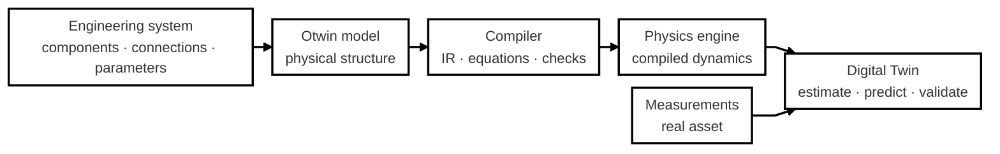

#### A simulation tells you what a model does. A Digital Twin tells you what a particular asset is doing — and what the model has earned the right to predict

<br>

# The Otwin idea

Engineering systems are not purely mathematical and they are not purely data-driven. 
Some things are known:

* conservation laws;
* energy storage;
* component relationships;
* electrical, mechanical, hydraulic or thermal behaviour;
* physical constraints.

Other things are uncertain:

* friction;
* losses;
* degradation;
* unknown loads;
* unmodelled phenomena;
* sensor noise;
* changing parameters.

Otwin is designed around the idea that **known physics should remain structure**, while data should be used to identify and model what the physics does not know.

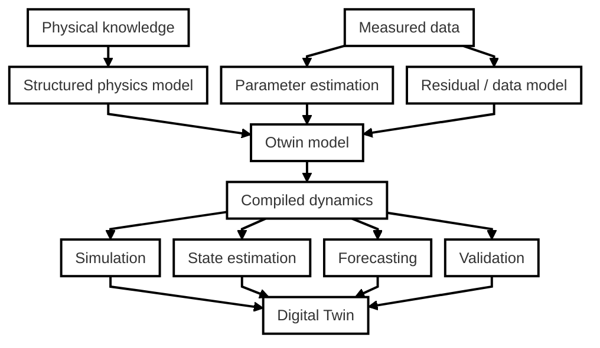

This leads to a simple principle: **Do not throw away known physics just because some of the physics is unknown.** Use structure where it is known. Use data where it is needed. Keep the two separate enough that you can inspect, test and validate both.

<br>

# From a Python library to an open modeling ecosystem

Otwin is Python-first, but the architecture is intentionally larger than a Python package. The long-term idea is to separate:

```text
WHAT A PHYSICAL MODEL MEANS
            │
            ▼
     OTWIN SPECIFICATION
            │
            ▼
     CONFORMANCE TESTS
            │
      ┌─────┼─────┐
      │     │     │
   Python  Julia  MATLAB
      │     │     │
      └─────┼─────┘
            │
            ▼
    CONFORMANT IMPLEMENTATIONS
```

A physics model should not be considered correct simply because one implementation produces plausible numbers. It should be possible to define what the model means, define physical properties that must hold, provide known reference answers, and test independent implementations against the same specification.

That is the role of **[otwin-spec](https://github.com/otwin-core/otwin-spec)**.

<br>

# The Otwin specification

`otwin-spec` is part of the architecture, not an add-on. Otwin includes a normative specification and a language-agnostic conformance suite.

#### The specification defines what an Otwin model means. Implementations prove that they conform to it.

The conformance suite contains physical systems with known answers and tests structural properties such as:

* skew-symmetry of interconnection matrices;
* positive-semidefinite dissipation;
* passivity;
* energy conservation;
* energy non-increase where required;
* physical constitutive laws;
* thermodynamic constraints;
* manifest validity.

The suite is designed to catch deliberately broken implementations, not just confirm that a reference implementation passes its own tests.

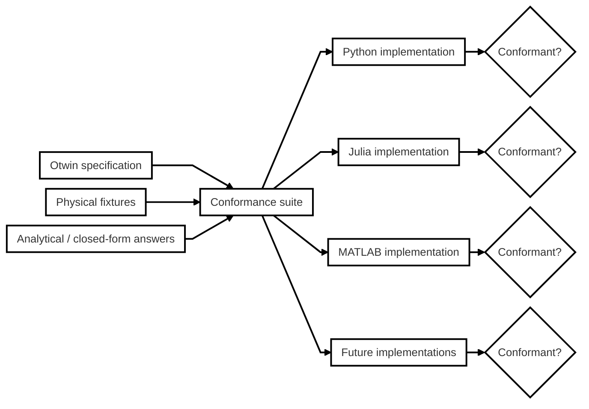

This is an important architectural boundary: **Otwin is not defined only by its Python implementation.** The Python implementation is the reference implementation and the primary user interface today. The specification defines the contract that allows the ecosystem to grow beyond it.

See **[otwin-spec](https://github.com/otwin-core/otwin-spec)** for the normative specification and conformance suite.

<br>

# Install

```bash
pip install "otwin[engine]"
```

`otwin` provides the Python modeling framework.

`otwin[engine]` adds the compiled Rust runtime, with binary wheels for Linux, macOS and Windows.

Without the engine package, models can still run through the NumPy reference backend.

<br>

# Quick start

A mass hanging from a spring and damper under gravity. You describe the physical system. You don't need to write Newton's equation yourself.

Two verbs describe any system, and one rule says which to use. `>>` joins components in a line, the way the drawing reads: `mass >> spring >> ceiling`. `connect` joins ports where a line is not enough: three things meeting at one point, or a second circuit attached to a port. Here the mass hangs from the spring, and the damper and the weight meet the mass at the same point.

```python
import otwin
from otwin.components.mechanical import (
    Mass,
    Spring,
    Damper,
    ForceSource,
    Fixed,
)

k, m, c, g0 = 20.0, 1.0, 0.3, 9.81

mass = Mass(m, name="mass")
spring = Spring(k, name="spring")
damper = Damper(c, name="damper")

weight = ForceSource(m * g0, name="weight")
ceiling = Fixed(name="ceiling")

system = mass >> spring >> ceiling                 # the line
system.connect(mass.flange, damper.a, weight.flange)   # the damper and the weight meet the mass
system.connect(damper.b, ceiling.port)             # the damper's other end

model = otwin.compile(system)

run = model.simulate(
    t_span=(0, 20),
    dt=0.05,
)

q = run["spring.extension"]

print(f"Static equilibrium q* = m g / k = {m*g0/k:.3f} m")
print(f"Lowest point reached: q = {q.max():.3f} m")
print(f"Final position: q = {q[-1]:.3f} m")

print(
    f"Largest energy violation: "
    f"{run.energy_balance()['max_violation']:.1e} J"
)
```

<div align="center">


</div>

Output:

```text
Static equilibrium q* = m g / k = 0.491 m
Lowest point reached: q = 0.932 m
Final position: q = 0.477 m
Largest energy violation: 0.0e+00 J
```

Nobody wrote Newton's law.

The physical structure was described through components and connections, and the compiler derived the executable dynamics.

The compiled model also carries the energy structure of the system.

```python
model.summary()
model.structure()
model.ir()
```

These interfaces let you inspect what Otwin actually built.

<br>

# From the data sheet to the model

Real work starts from devices, not from springs. A battery module, as its data sheet describes it: capacity, the open-circuit voltage curve, the internal resistance, two polarisation branches, the heat capacity. Then the cooling. Nothing else.

<div align="center">


</div>

```python
import otwin
from otwin.components.battery import Battery
from otwin.components.electrical import CurrentSource, Ground
from otwin.components.thermal import Ambient, Convection

cell = Battery(
    capacity=100.0,                                # Ah
    ocv=[(0.0, 2.8), (0.05, 3.15), (0.5, 3.3), (0.95, 3.4), (1.0, 3.55)],
    resistance=1e-3,                               # ohm
    rc_branches=[(0.5e-3, 20e3), (0.8e-3, 200e3)],  # (ohm, F)
    thermal=1200.0,                                # J/K
    soc=0.9,
    name="cell",
)
load = CurrentSource(None, name="load")            # amperes, an input
cooling = Convection(0.5, name="cooling")          # W/K
air = Ambient(298.15, name="air")
gnd = Ground(name="gnd")

module = gnd >> cell >> load >> gnd                # the electrical loop, closed on ground
module.connect(cell.thermal, cooling.a)            # the thermal circuit hangs off the cell
module.connect(cooling.b, air.port)

model = otwin.compile(module, dt=10.0)

state = model.initial_state()
for _ in range(360):                               # one hour at 50 A
    state = model.step(state, {"load": 50.0})

out = model.outputs(state)
print(f"soc {out['cell.soc']:.2f}  voltage {out['cell.voltage']:.3f} V  "
      f"cell {out['cell.temperature'] - 273.15:.1f} °C  heat {out['cell.heat_flow']:.2f} W")
```

```text
soc 0.40  voltage 3.152 V  cell 33.8 °C  heat 5.75 W
```

The model has four states: the charge, two polarisation charges and the heat in the cell. Every voltage, current, power and temperature inside the module is a named output. `with_parameters` ages the cells or clogs the cooling without rebuilding anything; [`examples/battery_that_runs_hot.py`](examples/battery_that_runs_hot.py) uses that to tell the two apart.

A pump line is a line and nothing else, so `>>` is all it takes; one-port components (a tank, the outfall) join at the ends:

<div align="center">


</div>

```python
from otwin.components.hydraulic import Atmosphere, Filter, Pipe, Pump, Tank

line = (
    Tank(area=5000.0, level=3.0, name="tank")
    >> Pipe(resistance=5e5, name="suction")
    >> Pump(shutoff=4e5, max_flow=0.08, name="pump")      # nameplate curve
    >> Filter(resistance=2e6, name="filter")
    >> Atmosphere(name="outfall")
)
model = otwin.compile(line, dt=1.0)

state = model.initial_state()
for _ in range(900):
    state = model.step(state)
print(f"{model.outputs(state)['pump.flow'] * 3600:.0f} m³/h")

fouled = model.with_parameters({"filter.fouling": 1.0})   # twice the clean resistance
state = fouled.initial_state()
for _ in range(900):
    state = fouled.step(state)
print(f"{fouled.outputs(state)['pump.flow'] * 3600:.0f} m³/h with a fouled filter")
```

```text
235 m³/h
196 m³/h with a fouled filter
```

Nobody wrote a pump equation either. The pump is a pressure source at shut-off, a loss that follows the curve and the inertia of the water in it; the compiler reads the operating point off the network.

<br>

# How it works

Otwin treats the physical system as a graph. **Components** define physical behaviour. **Connections** define how components interact. The compiler turns that graph into an executable dynamical model.

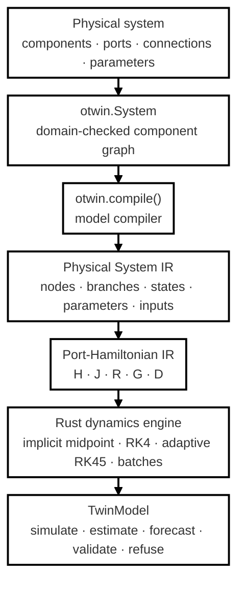

Every connection is a physical node. 

* The **across** variable is shared at the node (voltage, velocity, pressure, temperature). 
* The **through** variable balances at the node (current, force, fluid flow, heat flow)

Storage elements define how energy is stored. Dissipative elements define losses. Sources provide inputs. Two-ports connect different physical domains. The resulting dynamics are expressed internally in port-Hamiltonian form:

$$
\dot{x} = \big(J(x)-R(x)\big)\nabla H(x) + G(x)u $$

where:

* $H(x)$ is stored energy;
* $J(x)$ represents energy exchange;
* $R(x)$ represents dissipation;
* $G(x)$ represents external ports;
* $u$ represents external inputs.

The output is:

$$
y = G(x)^\top\nabla H(x) + D(x)u
$$

Otwin builds $J$ as skew-symmetric, so the interconnection represents energy exchange rather than energy creation or destruction. Dissipation is represented explicitly through $R$. The important point is that this structure belongs to the **model**, not merely to the numerical solver. You can inspect the internal representation with:

```python
model.ir()
```

<br>

# Physical consistency before numerical simulation

A physics engine should not wait for a numerical solver to discover that the physical model is badly formed. Otwin checks physical topology during compilation. For example, directly connecting dependent storage elements or sources can create a physically ambiguous model. Instead of producing a low-level numerical failure later, the compiler reports the physical problem in terms of the components you created:

```text
CompileError:
dependent storages or sources: load, motor.rotor form a loop
that fixes the same potential twice.

Two capacitors in parallel, two inertias on one shaft,
two masses rigidly joined, a voltage source across a capacitor
or a tank connected directly to a pressure source can create
this situation.

Merge the two stores into one, or introduce a resistor,
pipe, damper or stiff spring between them.
```

The principle is simple: **If the physical topology is invalid or ambiguous, catch it before the numerical solver ever sees it.**

<br>

# The physics engine

The core Otwin workflow is:

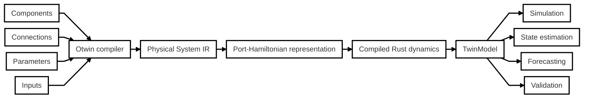

The architecture deliberately separates the modeling layer from the execution layer.

* Python describes and operates the model.
* Rust executes the compiled dynamics.

The same compiled model can therefore become the foundation for simulation, estimation, forecasting and validation.

<br>

# Components

Otwin provides physical component primitives across multiple engineering domains.

See [COMPONENTS.md](https://github.com/otwin-core/otwin/blob/main/COMPONENTS.md) for the current component catalogue.

| Domain     | Across           | Through   | Components                                                                                |
| ---------- | ---------------- | --------- | ----------------------------------------------------------------------------------------- |
| Electrical | voltage          | current   | `Resistor`, `Capacitor`, `Inductor`, `VoltageSource`, `CurrentSource`, `Ground`           |
| Mechanical | velocity         | force     | `Mass`, `Spring`, `Damper`, `ForceSource`, `VelocitySource`, `Fixed`                      |
| Rotational | angular velocity | torque    | `Inertia`, `TorsionSpring`, `RotationalDamper`, `TorqueSource`, `SpeedSource`, `Housing`  |
| Hydraulic  | pressure         | flow      | `Tank`, `Orifice`, `Pipe`, `FluidInertance`, `FlowSource`, `PressureSource`, `Filter`, `Pump`, `Atmosphere` |
| Thermal    | temperature      | heat flow | `ThermalMass`, `ThermalResistance`, `Convection`, `HeatSource`, `Losses`, `Ambient`       |
| Two-ports  |                  |           | `Transformer`, `Gyrator`                                                                  |
| Devices    |                  |           | `Battery`, `Pump`, `DCMotor`, catalogue reference systems                                 |
| Fundamental | any             | any       | `Storage`, `Dissipator`, `Source`, `Reference` — the roles every component above plays, with the domain as an argument |

Dissipative elements can use nonlinear constitutive laws:

```python
RotationalDamper(
    law=lambda w: (c1 + c2*w**2) * w
)
```

<br>

# Multi-domain physics

Real engineering systems rarely belong to a single physical domain. A motor is an electrical system coupled to a rotating mechanical system. A pump couples electrical, rotational and hydraulic behaviour. A heat pump couples electrical, mechanical, thermal and fluid systems. Otwin represents these relationships through the same component-and-connection model.

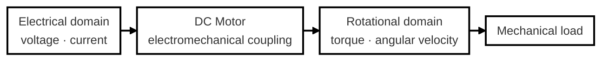

For example, a supply, a DC motor and a fan on its shaft:

<div align="center">


</div>

```python
import otwin

from otwin.components.electrical import (
    VoltageSource,
    Ground,
)

from otwin.components.composite import DCMotor

from otwin.components.rotational import (
    RotationalDamper,
    Housing,
)

supply = VoltageSource(
    None,
    name="supply",
)

motor = DCMotor(
    resistance=1.0,
    inductance=0.5,
    torque_constant=0.5,
    inertia=0.01,
    friction=0.1,
    name="motor",
)

fan = RotationalDamper(
    law=lambda w: 0.002 * w * abs(w),
    name="fan",
)

gnd = Ground()
housing = Housing()

drive = gnd >> supply >> motor >> gnd        # the electrical loop
drive.connect(motor.shaft, fan.a)            # the shaft: a second circuit, in another domain
drive.connect(fan.b, housing.port)

model = otwin.compile(drive)

run = model.simulate(
    t_span=(0, 3),
    dt=0.001,
    inputs={"supply": 24.0},
)

print(
    f"speed after 3 s: "
    f"{run['motor.rotor.angular_velocity'][-1]:.2f} rad/s"
)

print(
    f"current: "
    f"{run['motor.armature.current'][-1]:.3f} A"
)

p_in = -run["supply.power"][-1]

p_out = (
    run["motor.armature_resistance.power"]
    + run["motor.bearing.power"]
    + run["fan.power"]
)[-1]

print(
    f"electrical power in {p_in:.2f} W = "
    f"copper + bearing + fan {p_out:.2f} W at steady state"
)
```

Output:

```text
speed after 3 s: 29.36 rad/s   current: 9.320 A
electrical power in 223.68 W = copper + bearing + fan 223.68 W at steady state
```

The motor is a composition of physical primitives. The compiler sees the physical structure rather than relying on a special-case motor equation. Quantities such as:

```python
motor.bearing.power
supply.power
fan.torque
```

are generated as model outputs alongside the states.

<br>

# Control laws

Some engineering relationships are not constant inputs. A converter may operate at constant power. A valve may depend on pressure. A thermostat may depend on temperature. A controller may depend on the current state. Otwin lets you express these relationships using the model's own quantities.

```python
import otwin

from otwin.expr import maximum
from otwin.components.catalogue import water_tank

tank = otwin.compile(
    water_tank(level=2.0)
)

level = tank.symbol("tank.level")

run = tank.simulate(
    t=range(0, 601),
    inputs={
        "inlet": maximum(
            0.0,
            5.0 * (1.5 - level),
        )
    },
)

print(
    f"level {run['tank.level'][0]:.3f} m "
    f"-> {run['tank.level'][-1]:.3f} m"
)

print(
    f"inflow {run['inlet'][0]:.3f} "
    f"-> {run['inlet'][-1]:.3f} m3/s"
)
```

Output:

```text
level 2.000 m -> 1.436 m
inflow 0.000 -> 0.319 m3/s
```

A Python function `f(t, x)` is also accepted. It runs sample-and-hold at the grid rate, which is appropriate for a digital controller.

<br>

# Physics + data

Not every physical mechanism is known exactly. That does not mean the entire system has to become a black box. Otwin supports a continuum between first-principles models and purely data-driven models.

<div align="center">

|                                                                                                      |               |                                                                                     |
| ---------------------------------------------------------------------------------------------------- | ------------- | ----------------------------------------------------------------------------------- |
|  | **White box** | The equations and parameters come from known physical relationships.                |
|   | **Grey box**  | Physics defines the structure; data identifies unknown parameters or mechanisms.    |
|  | **Black box** | The model is determined primarily from data without an explicit physical structure. |

</div>

The compiled physical model is the white-box model foundation. Otwin lets data fill the gaps without throwing that structure away.

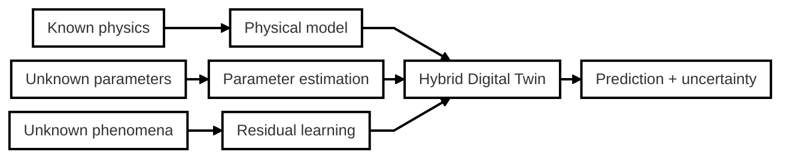

This means you can start from physical knowledge and progressively incorporate measurements without abandoning the model you understand.

<br>

# Estimate the missing physics

Suppose an oscillator has quadratic drag that the original model does not include. The physical structure is still useful. Add a residual term and estimate its coefficient from measurements:

```python
import numpy as np
import otwin

from otwin.components.catalogue import (
    mass_spring_damper,
)

physics = otwin.compile(
    mass_spring_damper(
        m=1.0,
        k=2.0,
        c=0.3,
        position=1.0,
    )
)

v = physics.symbol("mass.velocity")

plant = physics.with_residual(
    {
        "mass.momentum":
            -0.9 * v * abs(v)
    }
)

t = np.linspace(0, 8, 161)

measured = (
    plant.simulate(t=t)["spring.extension"]
    + np.random.default_rng(0).normal(
        0,
        1e-3,
        t.size,
    )
)

grey = physics.with_residual(
    {
        "mass.momentum":
            -physics.parameter("drag")
            * v
            * abs(v)
    },
    parameters={
        "drag": 0.1
    },
)

fit = otwin.fit_parameters(
    grey,
    t,
    {"spring.extension": measured},
    ["drag", "spring.stiffness"],
)

print(fit)
```

Output:

```text
FitResult(
    drag=0.900957,
    spring.stiffness=2.00025;
    cost=7.374e-05,
    evaluations=21,
    identified={
        'drag': True,
        'spring.stiffness': True
    }
)
```

`fit.identifiability` also reports whether the fitted parameters are actually supported by the available data (collinearity, sufficient data span, stability under bootstrap resampling). A fitted number is not automatically an identified parameter.

<br>

# Hybrid models

When the physics leaves something unexplained, do not automatically replace the physics with a black box. You can model the residual.

```python
otwin.HybridModel(
    physics,
    residual,
)
```

The residual can be learned with a Gaussian process, neural network or another callable model. The physical model remains the structural prior.

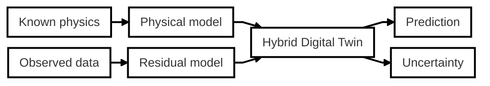

`otwin.hybrid.residual_data` provides the training target representing what the physical model leaves unexplained.

<br>

# Custom dynamics

When a system is outside the component library, you can still use the rest of the Otwin stack.

```python
otwin.CustomDynamics(
    f,
    n_states,
    n_inputs,
)
```

The resulting model follows the same core interface:

```text
simulate()
step()
rhs()
observe()
```

This provides a path for models that do not yet have a native component representation while keeping them compatible with estimation and forecasting workflows.

<br>

# From model to Digital Twin

A simulation model describes a system. A Digital Twin represents a **specific physical asset** and keeps its model connected to observations of that asset.

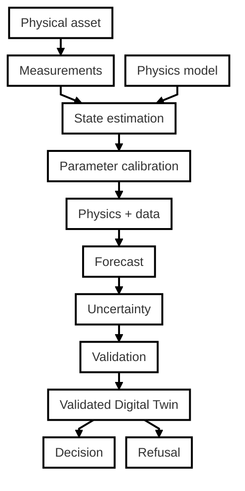

The model can therefore move through a lifecycle:

```text
physical knowledge
        ↓
physical model
        ↓
compiled dynamics
        ↓
measurements
        ↓
state estimation
        ↓
parameter calibration
        ↓
physics + data
        ↓
forecast
        ↓
uncertainty
        ↓
validation
        ↓
Digital Twin
```

The goal is not merely to produce a number, is to produce a number **with evidence about why the number should be trusted**.

<br>

# State estimation

A compiled model is a `TwinModel`. Measurements can be mapped onto model quantities and used to estimate hidden states.

| Estimator                  | Use it when                                                   |
| -------------------------- | ------------------------------------------------------------- |
| `ExtendedKalmanFilter`     | Nonlinear model with approximately Gaussian measurement noise |
| `MovingHorizonEstimator`   | The state has physical bounds                                 |
| `EnergyConsistentObserver` | State corrections must respect the energy balance             |

For example, a bounded state should not become `1.05` simply because a noisy sensor suggested it. The moving-horizon estimator can enforce physical state bounds. The energy-consistent observer constrains corrections so they cannot introduce energy that the physical ports did not supply.

<br>

# Uncertainty

An uncertainty interval should mean something measurable. If a model reports a 90% prediction interval, its coverage should be evaluated against out-of-sample observations. Otwin calibrates uncertainty from rolling-origin forecast errors rather than simply using in-sample residuals.

```python
import numpy as np

from otwin.forecast import (
    rolling_origin_residuals,
    horizon_conformal,
)

rng = np.random.default_rng(0)

cycles = np.arange(300)

capacity = (
    1.0
    - 2.6e-4 * cycles
    - 4.0e-3 * np.sqrt(cycles)
    + rng.normal(0, 1.5e-3, 300)
)


class FadeLaw:
    """Fits C = C0 - a*n - b*sqrt(n) to history."""

    def forecast(self, history, horizon):
        h = np.asarray(history, float).ravel()
        n = np.arange(len(h))

        coef, *_ = np.linalg.lstsq(
            np.column_stack([
                np.ones_like(n),
                n,
                np.sqrt(n),
            ]),
            h,
            rcond=None,
        )

        f = np.arange(
            len(h),
            len(h) + horizon,
        )

        return (
            np.column_stack([
                np.ones_like(f),
                f,
                np.sqrt(f),
            ])
            @ coef
        ).reshape(-1, 1)


train = capacity[:240]


def refit_forecast(history, horizon):
    return FadeLaw().forecast(
        history,
        horizon,
    ).ravel()


residuals, horizons = rolling_origin_residuals(
    refit_forecast,
    train,
    step=5,
    max_horizon=60,
)

band = horizon_conformal(
    residuals,
    horizons,
    level=0.90,
    max_horizon=60,
)

lower, upper = band.apply(
    refit_forecast(train, 60)
)

truth = capacity[240:300]

print(
    f"{residuals.size} residuals "
    f"over horizons 1..{horizons.max()}"
)

print(
    f"half-width "
    f"{(upper[0]-lower[0])/2:.4f} at h=1, "
    f"{(upper[-1]-lower[-1])/2:.4f} at h=60"
)

print(
    f"measured coverage: "
    f"{np.mean((truth >= lower) & (truth <= upper)):.0%} "
    f"(target 90%)"
)
```

Output:

```text
1590 residuals over horizons 1..60
half-width 0.0023 at h=1, 0.0030 at h=60
measured coverage: 90% (target 90%)
```

When the available calibration data is insufficient to support the requested confidence level, Otwin does not silently manufacture a narrow interval. It returns an interval that reflects the lack of evidence.

<br>

# Validation

A model is not validated because it fits historical data. Its predictions must be evaluated out of sample. Otwin provides rolling-origin evaluation against meaningful baseline forecasts:

```python
from otwin.forecast import evaluate

print(
    evaluate(
        FadeLaw(),
        capacity.reshape(-1, 1),
        protocol="rolling_origin",
        n_folds=5,
        horizon=30,
    )
)
```

Example output:

```text
EvalReport (rolling_origin, 5 folds)
──────────────────────────────────────────────────────────────
Skill Score (vs best baseline): 0.77 (77% better)
Baseline: persistence

Point Metrics:
  RMSE      0.0017 (baseline: 0.0074)
  MAE       0.0014 (baseline: 0.0064)
  NRMSE     0.1141
  MASE      0.8292
  THEIL_U   0.2395
──────────────────────────────────────────────────────────────
```

The protocol is designed to avoid common forecasting mistakes:

* treating in-sample residuals as forecast errors;
* leaking information from test data;
* evaluating without a reference forecast;
* allowing future observations into the model.

A model should have to earn its predictive claim.

<br>

# Identifiability

A fitted parameter is not necessarily a determined parameter. Otwin checks parameter identifiability through:

* **collinearity** — whether another parameter can reproduce the same sensitivity;
* **span** — whether the data covers enough of the relevant dynamics;
* **stability** — whether bootstrap resampling produces consistent estimates.

`fit_parameters` records these results.

This information can then become part of the model manifest and validation envelope.

<br>

# Validity envelopes

A Digital Twin should know the boundary of its evidence. A model validated for one operating region is not automatically validated everywhere. A model validated for 60 forecast cycles is not automatically validated for 180. `model.manifest()` creates a `TwinManifest` describing the model and its evidence:

```python
model.manifest()
```

The manifest records information such as:

* model structure;
* parameter values;
* estimated parameters;
* validation information;
* uncertainty calibration.

`otwin.advise.Envelope` can then turn that evidence into an answer or a refusal.

For example:

```text
outside the validated envelope:

- horizon: beyond the validated forecast horizon
  asked for 180
  validated to 60

This is a refusal, not a failure.
The twin has not been shown to answer this question.
Returning a number anyway would hide that limitation.
```

<br>

# The Digital Twin that knows when to say "no"

This is one of the central ideas in Otwin.

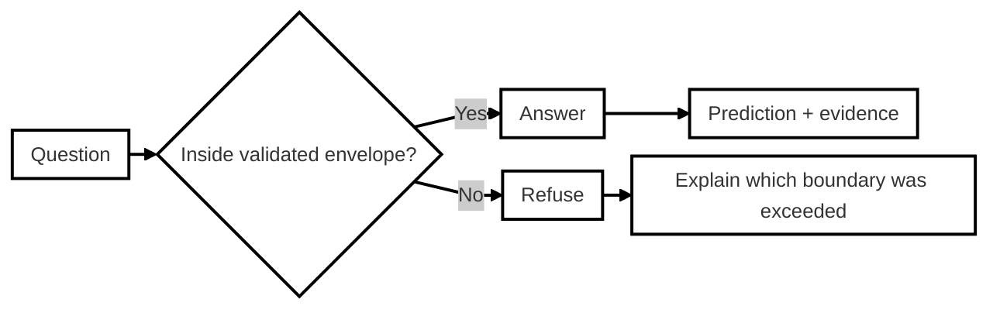

A model should not become more certain simply because someone asks it a harder question. Outside the evidence established during validation, the correct behaviour may be to report the limitation.

#### Refusal is not a failure. It is evidence that the model is enforcing the limits of what has actually been demonstrated.**

<br>

# What makes Otwin different?

Otwin brings several ideas together in one modeling stack.

* A physical model is executable. Components and connections are not just documentation. They compile into dynamics that can be simulated.
* Physics is structural. Energy storage, interconnection and dissipation are represented explicitly.
* The compiler understands the model. Physical topology can be checked before numerical integration.
* Multiple domains can be composed. Electrical, mechanical, rotational, hydraulic and thermal systems can be connected through common modeling concepts.
* Data does not have to replace physics. Unknown parameters and residual phenomena can be identified from measurements without throwing away known structure.
* Simulation and Digital Twin operation share the same model. The compiled model can support simulation, estimation, calibration, forecasting and validation.
* Predictions carry evidence. Validation, identifiability and uncertainty calibration become part of the model lifecycle.
* The specification can be independent of the implementation. `otwin-spec` provides a normative specification and conformance suite that can be used to test implementations independently.

<br>

# Examples

Two scripts start from a maintenance problem, build the system from its data sheet, and end with a number checked by hand. Neither contains an equation.

| Script                                                                                   | The problem                                                                                   | What decides it                                                      |
| ---------------------------------------------------------------------------------------- | --------------------------------------------------------------------------------------------- | -------------------------------------------------------------------- |
| [The battery module that runs hot](examples/battery_that_runs_hot.py)                    | A module reads a few degrees more than at commissioning. Aged cells, or a clogged air filter? | The voltage jump when the current reverses: only aged cells move it. |
| [The pump that asks for more every month](examples/pump_station_that_asks_for_more.py)   | The drive is turned up month after month to hold the flow through a fouling filter.           | The month at which the extra pumping energy has paid for a cleaning. |

The notebooks are designed around engineering questions rather than isolated API demonstrations. Each is intended to show a complete idea and something that can be tested or deliberately broken.

| #  | Notebook                                                                                               | Question                                                          | Data            |
| -- | ------------------------------------------------------------------------------------------------------ | ----------------------------------------------------------------- | --------------- |
| 01 | [A model that cannot invent energy](examples/otwin_01_a_model_that_cannot_invent_energy.ipynb)         | How do you know the equations obey the physical structure?        | Simulation      |
| 02 | [When the process makes entropy](examples/otwin_02_when_the_process_makes_entropy.ipynb)               | How do you represent a system that must obey the second law?      | Simulation      |
| 03 | [Scoring a forecast so it cannot flatter you](examples/otwin_03_scoring_a_forecast.ipynb)              | How good is a forecast when evaluated out of sample?              | NASA PCoE       |
| 04 | [A band whose 90% means 90%](examples/otwin_04_a_band_whose_90_means_90.ipynb)                         | How do you calibrate a prediction interval?                       | NASA PCoE       |
| 05 | [From a noisy sensor to a state you can trust](examples/otwin_05_from_a_noisy_sensor_to_a_state.ipynb) | How do you estimate a physical state from imperfect measurements? | NASA PCoE       |
| 06 | [The twin that says no](examples/otwin_06_the_twin_that_says_no.ipynb)                                 | What should a twin do outside its validation envelope?            | Simulation      |
| 07 | [All of it, on eight years of field data](examples/otwin_07_field_data.ipynb)                          | Does the protocol hold on real systems?                           | RWTH field data |
| 08 | [Does the physics earn its place?](examples/otwin_08_does_the_physics_earn_its_place.ipynb)            | Does structured physics improve the prediction?                   | RWTH field data |

The complete battery workflow is also available as:

```text
examples/bess_end_to_end.py
```

It demonstrates the complete chain from a modeled battery system to estimation, forecasting, uncertainty and refusal.

<br>

# The Otwin ecosystem

Otwin is designed as an open-source ecosystem rather than a single package.

| Repository                                                   | Role                                                            |
| ------------------------------------------------------------ | --------------------------------------------------------------- |
| [otwin](https://github.com/otwin-core/otwin)                 | Python framework, model compiler and physics engine             |
| [otwin-spec](https://github.com/otwin-core/otwin-spec)       | Normative specification and language-agnostic conformance suite |
| [otwin-hybrid](https://github.com/otwin-core/otwin-hybrid)   | Worked hybrid modeling case across Python, Julia and R          |
| [otwin-systems](https://github.com/otwin-core/otwin-systems) | Growing catalogue of physical systems with reference results    |

The engine in this repository is split into Rust crates:

```text
crates/
├── otwin-core
└── otwin-engine
```

`otwin-core` is a Rust crate containing the core runtime logic. `otwin-engine` provides the Python bindings through PyO3 and is published as the `otwin-engine` wheel.

See [`docs/developer`](docs/developer) for architecture and development documentation.

<br>

# Architecture at a glance

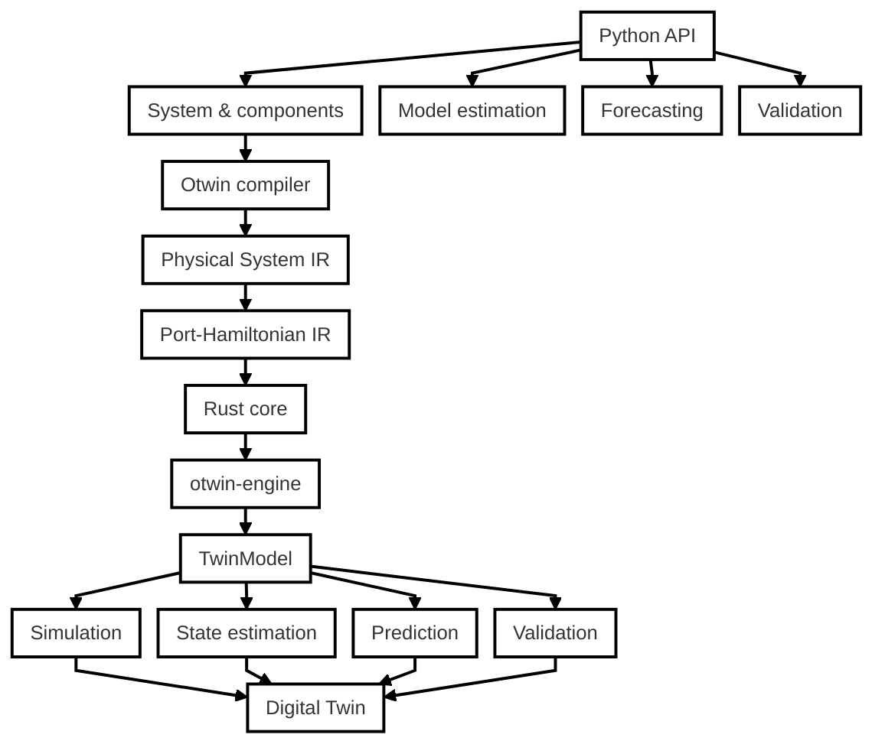

The separation is deliberate:

```text
Python
  │
  │ describes and operates
  ▼
Physical model
  │
  ▼
Compiler
  │
  ▼
Intermediate representations
  │
  ▼
Rust runtime
  │
  │ executes
  ▼
Compiled dynamics
```

The same architecture also makes it possible to separate the implementation from the specification:

```text
                  OTWIN SPEC
                      │
          ┌───────────┼───────────┐
          │           │           │
      Reference     Tests     Manifest
      semantics   fixtures     schema
          │           │           │
          └───────────┼───────────┘
                      │
              CONFORMANCE
                      │
             ┌────────┼────────┐
             │        │        │
           Python   Julia    MATLAB
```

<br>

# Design principles

| Principle                           | Description                                                                                                     |
| ----------------------------------- | --------------------------------------------------------------------------------------------------------------- |
| **Physics first**                   | If a physical relationship is known, encode it explicitly.                                                      |
| **Structure matters**               | Energy, dissipation, interconnection and conservation laws should be properties of the model whenever possible. |
| **Compile the model**               | The physical description should become executable dynamics, not remain a diagram or collection of equations.    |
| **Check before solving**            | Physically invalid or ambiguous topologies should be detected before numerical simulation.                      |
| **Data fills the gaps**             | Use measurements to identify parameters and residual physics instead of discarding known structure.             |
| **One model, multiple workflows**   | Simulation, estimation, forecasting and validation should operate on the same model representation.             |
| **Validation is part of the model** | A prediction should carry evidence about how it was evaluated.                                                  |
| **Uncertainty must be measured**    | A confidence level without measured coverage is not enough.                                                     |
| **Specifications matter**           | A physical claim should be testable independently of one implementation.                                        |
| **Know when not to answer**         | A Digital Twin should expose the limits of its evidence rather than hide them.                                  |
<br>

# Contributing

Contributions are welcome.

A new physical component is one of the easiest places to start:

1. define the component;
2. define its ports;
3. define its parameters;
4. define its constitutive law;
5. provide a closed-form or reference result where possible;
6. add the corresponding tests;
7. consider whether the behaviour belongs in the specification and conformance suite.

See [CONTRIBUTING.md](CONTRIBUTING.md).

For specification work, see [otwin-spec](https://github.com/otwin-core/otwin-spec).

<br>

# Issues

Found a bug, have a modeling problem, want to propose a component, or want to discuss the specification?

[Open an issue](https://github.com/otwin-core/otwin/issues).

<br>

# Citing

Each repository in the Otwin project includes a `CITATION.cff`.

If you use Otwin in research, engineering work or publications, please cite the relevant repository.

<br>

# License

Otwin is released under the Apache License 2.0.

See [LICENSE](LICENSE) for the full license text.

